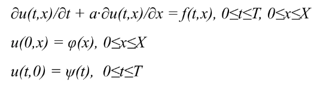
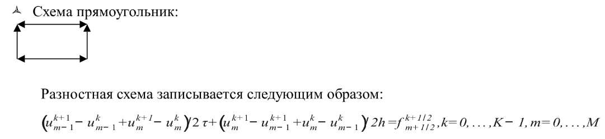

# Math solver #
##### 3rd grade MPI #####

## Target ##



To more detail about project look at [**task documentation**](task.pdf)

# Brief explanation

1. Implement 2 independent version and compare results to
make sure about correctness.
```cpp
  auto solution = solveParallel(scale, phi, psi, f, size, rank);
  auto check = solveLinear(scale, phi, psi, f);
```
2. Define boundary conditions in arbitrary way (but matching each other).
```cpp
  auto phi = [](double x) -> double { return x; };
  auto psi = [](double t) -> double { return t; };
  auto f = [](double x, double t) -> double { return x + t; };
  std::generate(data[0].begin(), data[0].end(),
                [n = 0, &phi, scale]() mutable { return phi(scale.h * n++); });
  std::for_each(data.begin() + 1, data.end(),
                [n = 1, &psi, scale](std::vector<double> &arr) mutable {
                  arr[0] = psi(scale.tau * n++);});
```
3. Filling explicit data.
```cpp
  double tauh = (scale.h + scale.tau) / (2 * scale.h * scale.tau);
  for (int x = 0; x < sizeX - 1; ++x)
    data[curT + 1][x + 1] =
        (f(scale.tau * (0.5 + curT), scale.h * (0.5 + x + offset)) +
         (data[curT][x] + data[curT][x + 1] - data[curT + 1][x]) / 2.0 /
             scale.tau +
         (data[curT][x] - data[curT][x + 1] + data[curT + 1][x]) / 2.0 /
             scale.h) /
        tauh;
```

## Build ##

**Dependencies**: compiler: c++20, boost: program_options, mpi: c++

> - *mkdir build*
> - *cd build*
> - *cmake ../*
> - *cmake --build .*
> - *mpirun -np* **threads** *./run*

It launch default settings, use **--help** to find more about application.

## Example ##

* Use *--oversubscribe* option to use as many threads as you want
* To redefine boundary conditions or function in equation just correct **phi** or **psi** or **f** in main function.
* Concrete example: ```mpirun -np 4 ./run --size=15 --x=0.5 --tau=0.5```

## Task to access ##

> - *cd build*
> - *mpic++ ../accessToLab.cpp -o ./access*
> - *mpirun -np* **threads** *access*

According to data that is got on my computer, it's about **2 micro-seconds**
and not depend on count of used threads.

## MPI speed analysis ##

To check not for answer, just for time use **--time** option

| Threads | Size | Acceleration |
| --- | --- | --- |
| 2 | 15 | 0.26 |
| 2 | 30 | 0.76 |
| 2 | 60 | 0.98 |
| 2 | 100 | 1.38 |
| 2 | 200 | 1.84 |
| 2 | 400 | 1.96 |
| 2 | 800 | 1.6 |
| 2 | 1600 | 1.76 |
| Threads | Size | Acceleration |
| 3 | 15 | 0.16 |
| 3 | 30 | 0.44 |
| 3 | 60 | 0.69 |
| 3 | 100 | 1.29 |
| 3 | 200 | 1.99 |
| 3 | 400 | 1.79 |
| 3 | 800 | 1.82 |
| 3 | 1600 | 2.13 |
| 3 | 2400 | 2.43 |
| 3 | 4000 | 2.58 |
| Threads | Size | Acceleration |
| 4 | 15 | 0.075 |
| 4 | 30 | 0.37 |
| 4 | 60 | 0.67 |
| 4 | 100 | 1.36 |
| 4 | 200 | 1.5 |
| 4 | 400 | 1.62 |
| 4 | 800 | 2.09 |
| 4 | 1600 | 2.17 |
| 4 | 2400 | 2.51 |
| 4 | 4000 | 2.95 |
| 4 | 10000 | 3.07 |

